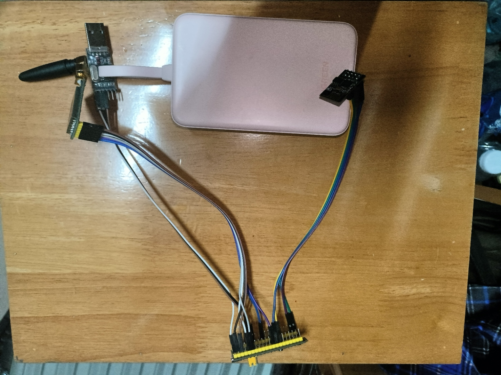
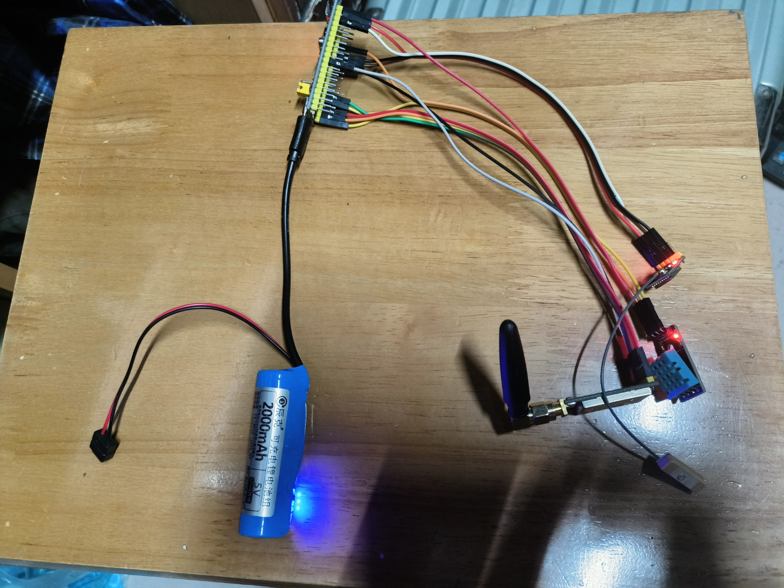
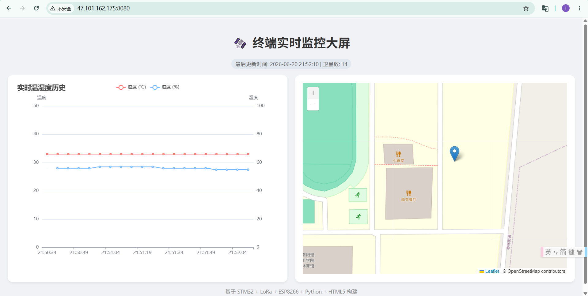

# sensorUpload-lora
Two STM32F103 boards with LoRa modules, one GPS and one DHT11 serve as end nodes; an ESP8266 acts as the gateway. This code is just for testing, and you can use it to verify whether your sensors work correctly.

## 📖 项目简介

本项目是一个完整的端到端（End-to-End）物联网监控系统。系统分为**发送端节点（Node）**、接收端网关（Gateway）**和**云端服务器（Cloud）三部分。 发送节点在野外采集温湿度与 GPS 经纬度数据，通过 LoRa 远距离无线传输至接收网关；接收网关通过 ESP8266 连接 WiFi，使用 MQTT 协议将数据上报至私有云服务器；云端基于 Python + SQLite 进行数据持久化，并提供一个基于 HTML5 + ECharts + Leaflet 的实时可视化大屏。

### ✨ 核心特性

- 📡 **远距离通信**：基于 ATK-MW1278D (LoRa) 模块，支持数公里级别的无线透传。
- 🌍 **GPS 实时定位**：集成 GPS 模块，动态追踪设备位置及可视卫星数。
- 🌡️ **环境感知**：使用 DHT11 传感器实时采集环境温湿度。
- ☁️ **云端独立部署**：脱离第三方限制，使用 Mosquitto (MQTT) + Flask 构建私有物联网云后台。
- 📊 **可视化大屏**：提供响应式 Web 前端，实时绘制温湿度双轴折线图与地理位置气泡地图。

## 📂 核心项目文件结构

项目包含三个主要部分：节点源码、网关源码以及云端代码。

```
📦 SensorUpload-LoRa
 ├── 📂 node/                   # 📡【发送端/节点】运行于野外采集端
 │   ├── 📂 Hardware/           # 硬件驱动层
 │   │   ├── atk_mw1278d.c/.h   # LoRa 模块驱动及 AT 指令配置
 │   │   ├── atk_mw1278d_uart.c # LoRa 串口透传及超时接收逻辑
 │   │   ├── dht11.c/.h         # 温湿度传感器驱动
 │   │   ├── gps.c/.h           # GPS 模块 NMEA 数据解析
 │   │   └── usart.c/.h         # 串口 1/2/3 底层初始化
 │   ├── 📂 Start/              # STM32 启动文件及系统核心
 │   └── 📂 User/               # 用户业务层
 │       └── main.c             # 数据采集 -> LoRa发送 主循环逻辑
 │
 ├── 📂 gateway/                # 🖲️【接收端/网关】运行于室内联网端
 │   ├── 📂 Hardware/           # 硬件驱动层 (LoRa、USART等同上)
 │   ├── 📂 NET/                # 网络协议层
 │   │   ├── 📂 MQTT/           # MQTT 协议封包/解包库
 │   │   ├── 📂 device/         # ESP8266 AT指令驱动 (连接WiFi与TCP)
 │   │   └── 📂 onenet/         # 平台接入层及鉴权算法 (Base64/HMAC等)
 │   └── 📂 User/
 │       └── main.c             # LoRa接收 -> MQTT封包 -> ESP8266上传
 │
 └── 📂 iot_project/            # ☁️【云端服务器】运行于 Ubuntu/CentOS
     ├── app.py                 # 后端核心 (Flask Web服务 + MQTT订阅 + SQLite存储)
     └── 📂 templates/
         └── index.html         # 前端大屏页面 (ECharts折线图 + Leaflet地图)
```

## 🔌 硬件接线指南

> 💡 提示 接线前请务必确认供电电压，LoRa 与 GPS 模块建议使用 `3.3V` 或 `5V`（根据模块丝印要求），**RX/TX 必须交叉连接**（即单片机的 TX 接模块的 RX，单片机的 RX 接模块的 TX）。

### 1. 发送端节点 (Node) 连线表

| 外设模块              | 模块引脚           | STM32 引脚                                                   | 说明 / 备注                                                  |
| --------------------- | ------------------ | ------------------------------------------------------------ | ------------------------------------------------------------ |
| **调试接口**          | RXD  TXD           | `PA9` (USART1_TX)  `PA10` (USART1_RX)                        | 连接 CH340 下载器，用于查看串口 Log 日志                     |
| **LoRa (ATK-MW1278)** | RXD  TXD  AUX  MD0 | `PB10` (USART3_TX)  `PB11` (USART3_RX)  详见宏定义  详见宏定义 | 负责远距离发送采集的数据。`AUX` 与 `MD0` 用于检测状态与进入配置模式 |
| **GPS 模块**          | RXD  TXD           | `PA2` (USART2_TX)  `PA3` (USART2_RX)                         | 负责接收卫星定位信号                                         |
| **DHT11 模块**        | DATA               | `PA0` (根据实际代码设定)                                     | 单总线通信，读取温湿度                                       |

### 2. 接收端网关 (Gateway) 连线表

| 外设模块              | 模块引脚           | STM32 引脚                                                   | 说明 / 备注                                                |
| --------------------- | ------------------ | ------------------------------------------------------------ | ---------------------------------------------------------- |
| **调试接口**          | RXD  TXD           | `PA9` (USART1_TX)  `PA10` (USART1_RX)                        | 连接电脑，查看接收端解析状态及 WiFi 连接日志               |
| **LoRa (ATK-MW1278)** | RXD  TXD  AUX  MD0 | `PB10` (USART3_TX)  `PB11` (USART3_RX)  详见宏定义  详见宏定义 | 负责接收远端 Node 节点发来的数据                           |
| **ESP8266 WiFi**      | RXD  TXD           | `PA2` (USART2_TX)  `PA3` (USART2_RX)                         | 负责连接路由器，将接收到的数据通过 MQTT 协议上传至云服务器 |

## 🚀 快速上手 (Quick Start)

1. **环境准备**
   - 准备两套 STM32F103 最小系统板。
   - 在服务器上安装 `mosquitto` 作为 MQTT 代理服务器。
   - 在服务器执行 `pip3 install flask paho-mqtt` 安装 Python 依赖。
2. **云端运行**
   - 开放云服务器的 `1883` 与 `8080` 端口防火墙。
   - 进入 `iot_project` 目录，执行 `python3 app.py` 启动云端监控系统。
3. **节点烧录**
   - 在网关 (Gateway) 代码的 `main.c` 中配置你的 `WIFI_SSID` 和 `WIFI_PASSWORD`，并将服务器 IP 改为你自己的公网 IP。
   - 分别将 Node 与 Gateway 代码编译后烧录进单片机。
4. **效果验证**
   - 打开浏览器访问 `http://你的公网IP:8080` 即可查看大屏交互数据。

## 🖼️ 项目效果图展示

### 1. 硬件实物与接线图

这里展示发送端与接收端的实际硬件组装与连线情况：





### 2. 云端大屏实时监控效果

这是运行在云服务器上的最终 Web 前端可视化界面：


